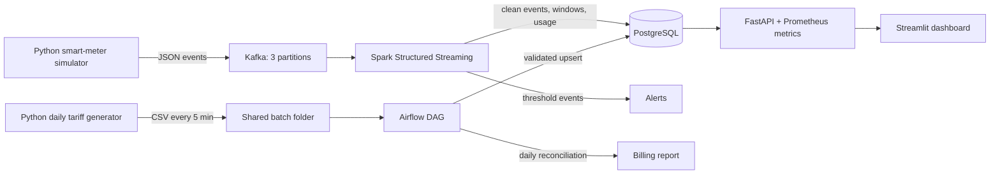

# Smart Grid Energy Monitoring & Billing

EC8203 Applied Big Data Engineering mini-project implementing a lightweight, end-to-end, Kappa-oriented data platform. It combines continuous smart-meter events with a simulated daily tariff feed and serves real-time grid metrics, alerts, and a consolidated household billing report.

## Business question

What is the current grid load and renewable contribution by zone, and what will each household's bill look like once daily tariff data is applied to consumption?

## Architecture decision

The solution is **Kappa-oriented** because the primary source of truth is the Kafka event stream and real-time processing logic is implemented once in Spark Structured Streaming. A small Airflow-managed batch path is retained for the externally supplied daily tariff reference feed and scheduled billing materialization.

Lambda was rejected for this two-week project because separate speed and batch implementations for meter events would duplicate transformation logic, increase operational cost, and introduce consistency risk. Kafka retention/checkpointing provides a replay route without a second meter-event code path. The trade-off is that long historical reprocessing would compete with the live Spark job in this single-node demonstration environment.

## Data flow



## Technology rationale

| Layer | Technology | Use-case justification |
|---|---|---|
| Ingestion | Apache Kafka | Partitioned, durable event buffer that decouples bursty meter production from processing and supports replay. |
| Streaming | Spark Structured Streaming | Event-time parsing, meaningful enrichment, aggregation, checkpointing, and Kafka integration with one Python API. |
| Orchestration | Apache Airflow | Visible, retryable, scheduled workflow for the daily tariff file and billing report. |
| Storage | PostgreSQL | Relational joins and indexed queries match tariff reconciliation, billing, API, and dashboard needs. |
| Serving | FastAPI + Streamlit | Separates a machine-readable API/metrics endpoint from a clear live operational dashboard. |
| Deployment | Docker Compose | Reproducible single command environment suitable for assessment and demonstration. |

## Simulated clock and assumptions

- One simulated day equals **five minutes** (`SIMULATED_DAY_SECONDS=300`).
- Thirty households and meters are simulated across four grid zones.
- Events arrive every two seconds by default.
- Meter data represents interval kWh readings, not cumulative meter counters.
- Negative values, missing identifiers, and invalid timestamps are rejected.
- Subsidised accounts receive a 15% adjustment in the demonstration billing formula.
- This is a single-node educational deployment, not a production HA cluster.

## Prerequisites

- Docker Desktop with Linux containers and WSL 2 backend
- Docker Compose v2+
- At least 8 GB RAM available to Docker; 10 GB is preferable
- Ports `5432`, `8000`, `8081`, `8501`, and `9092` available

## Quick start

1. Create the environment file:

   ```powershell
   Copy-Item .env.example .env
   ```

2. Build the images:

   ```powershell
   docker compose build
   ```

3. Start the platform:

   ```powershell
   docker compose up -d
   ```

4. Monitor startup:

   ```powershell
   docker compose ps
   docker compose logs -f kafka postgres spark-processor meter-producer
   ```

The first Spark build/start takes longer because PySpark and the Kafka connector are downloaded. Wait until the API health endpoint changes from `starting` to `healthy`.

## User interfaces

- Dashboard: <http://localhost:8501>
- Serving API docs: <http://localhost:8000/docs>
- Health check: <http://localhost:8000/health>
- Prometheus-format metrics: <http://localhost:8000/metrics>
- Airflow: <http://localhost:8081>

Airflow standalone prints its generated admin credentials in its logs:

```powershell
docker compose logs airflow | Select-String -Pattern "password|admin"
```

## Demonstrating the two ingestion paths

### Streaming

```powershell
docker compose logs -f meter-producer spark-processor
```

The producer publishes JSON events continuously. Every 18th event has zero solar output and every 25th event has high consumption, making the alert path reproducible.

### Daily batch

The tariff generator creates `tariffs_day_NNNN.csv` every five minutes. Airflow discovers each file, validates its schema and values, performs an idempotent PostgreSQL upsert, archives the file, and refreshes the billing report.

Trigger the DAG manually from Airflow for a fast demo, or wait for the five-minute schedule.

## Meaningful processing

- Schema validation and invalid-event quarantine
- UTC event-time parsing
- `net_grid_usage_kwh = consumption - solar`
- `renewable_ratio = solar / consumption`
- One-minute zone aggregations
- Daily per-household usage aggregation
- Latest applicable tariff join during billing reconciliation
- Subsidy-aware estimated bill
- Low-renewable and high-grid-load alerts

## Observability

- JSON structured logs from both data simulators and Spark
- `pipeline_heartbeats` table for Spark and Airflow
- `/health` no-data rule: unhealthy if no event arrives for 120 seconds
- `/metrics` exposes last-event age and unresolved-alert count
- `pipeline_alerts` stores threshold alerts with severity, value, and threshold
- Airflow task history shows batch retries and failures

Useful commands:

```powershell
docker compose ps
docker compose logs --tail 100 spark-processor
docker compose logs --tail 100 airflow
Invoke-RestMethod http://localhost:8000/health
Invoke-RestMethod http://localhost:8000/api/v1/pipeline
```

## Failure demonstration

Stop the producer:

```powershell
docker compose stop meter-producer
```

After 120 seconds, `/health` reports `unhealthy`. Restart it with:

```powershell
docker compose start meter-producer
```

## Tests

Host-side unit tests:

```powershell
python -m pip install -r requirements-dev.txt
python -m pytest -q
```

Configuration validation:

```powershell
docker compose config --quiet
```

## Stop and clean up

Stop services without deleting data:

```powershell
docker compose down
```

Do not add `-v` unless PostgreSQL, Kafka, Airflow, and Spark checkpoint data may be deleted.

## Repository map

```text
airflow/dags/       Scheduled tariff ingestion and billing DAG
api/                FastAPI serving, health, and Prometheus metrics
dashboard/          Streamlit operational dashboard
database/           PostgreSQL schema and indexes
docs/               Architecture, report, and demonstration guidance
producers/          Streaming and daily-batch Python simulators
spark/              Structured Streaming processing job
tests/              Unit tests for source and business rules
compose.yaml        Reproducible multi-service platform
```

## Production-scale limitations

- Single Kafka broker and local Spark execution provide no high availability.
- PostgreSQL writes are driver-side per micro-batch and need a scalable sink strategy at higher throughput.
- Alerts are stored and displayed but not routed to an on-call system.
- Secrets are development defaults; production should use a secrets manager.
- Exactly-once effects depend on primary keys and idempotent upserts rather than a distributed transaction across Kafka and PostgreSQL.
- Production deployment should use replicated Kafka, a Spark cluster, managed PostgreSQL, object storage for raw history, TLS, authentication, and centralized logs/metrics/traces.
